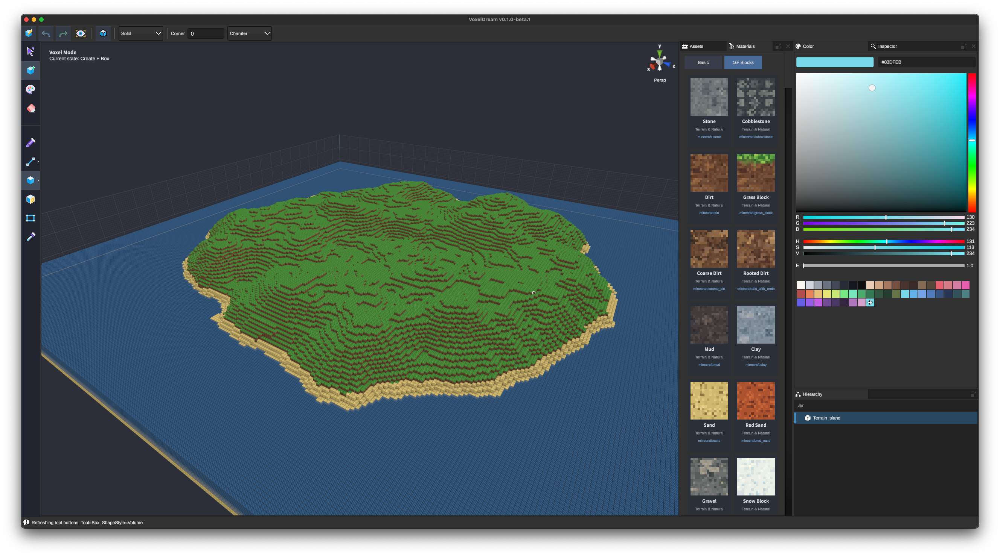
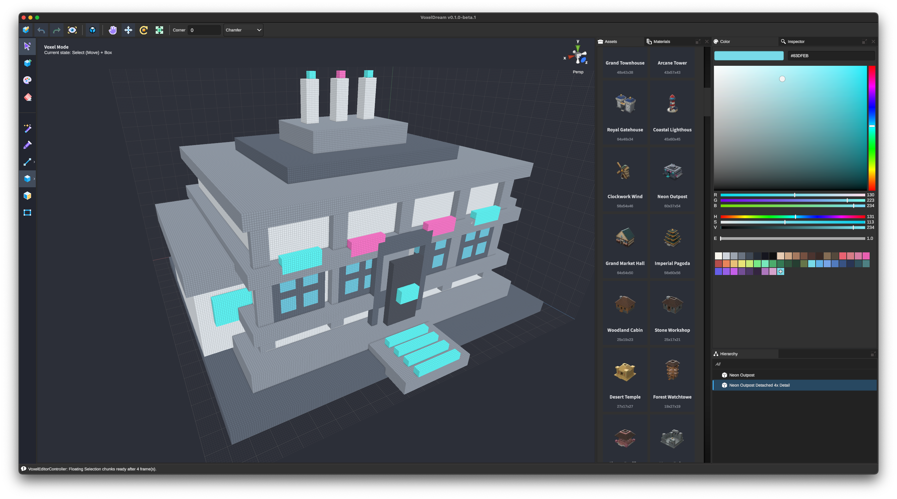
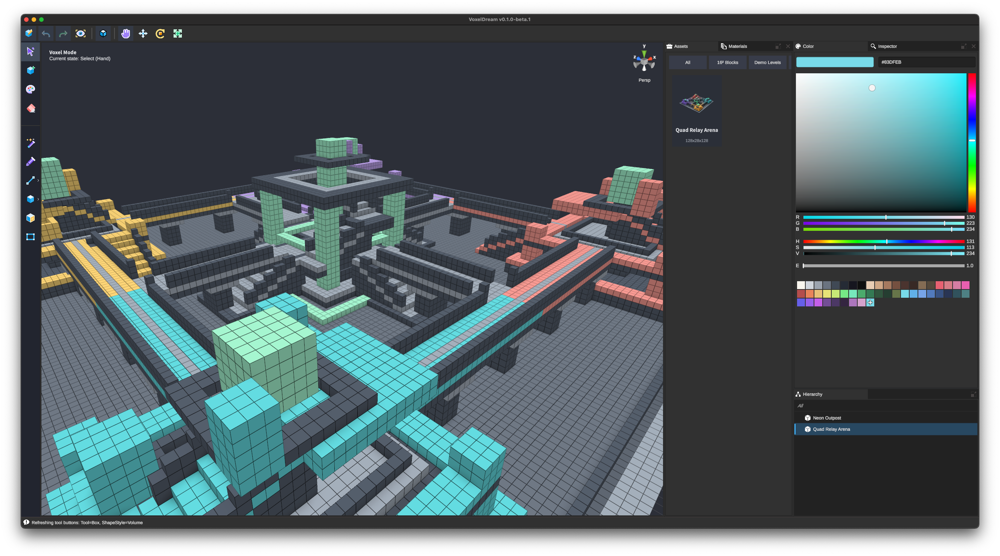
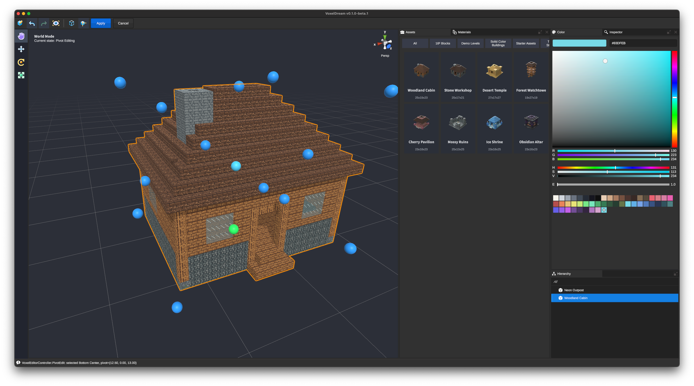

# VoxelDream

[简体中文](README.zh-CN.md)

> Like building with blocks—simple to start, practical to ship.

VoxelDream is a controllable voxel-based 3D creation tool for building, editing, and transforming game-ready assets and scenes. Start from scratch, images, meshes, or existing voxel content, refine everything with direct editing tools, and export your work to Minecraft, game engines, or standard 3D workflows.

> **Very Early Beta**
>
> Expect bugs, unfinished features, and possible changes to project files. Keep backups of important work.

## Screenshots

<table>
  <tr>
    <td></td>
    <td></td>
  </tr>
  <tr>
    <td align="center">Large voxel terrain</td>
    <td align="center">Voxel modeling and selection</td>
  </tr>
  <tr>
    <td></td>
    <td></td>
  </tr>
  <tr>
    <td align="center">Large and detailed voxel assets</td>
    <td align="center">World mode and pivot editing</td>
  </tr>
</table>

## Download

Download the latest build from [GitHub Releases](https://github.com/stylophone/voxeldream/releases/latest).

VoxelDream is also available on [itch.io](https://stylophone.itch.io/voxeldream).

## What you can do

### Shape and refine

- Draw freehand or build with lines, faces, boxes, spheres, cylinders, pyramids, prisms, and stairs.
- Select connected surfaces or regions, then recolor, duplicate, move, rotate, scale, or detach them.
- Work with solid-color palettes or Minecraft block materials.

### Build complete assets

- Keep multiple voxel assets in one project and arrange them in World mode with object transforms, hierarchy, and editable pivots.
- Move between World mode and focused voxel editing without losing the original editable voxel data.
- Import VVOX assets or turn PNG, JPEG, WebP, and BMP images into editable voxel content.
- Save and reopen complete `.voxproj` projects, not just flattened export files.

### Use the result elsewhere

- Export FBX meshes for standard 3D and game-engine workflows.
- Export Minecraft Add-On packages for supported Bedrock targets.
- Produce offline PNG renders and start quickly from the built-in asset library.

## Feedback

Found a bug or have a suggestion? [Open an Issue](https://github.com/stylophone/voxeldream/issues).

When reporting a bug, please include your operating system, the VoxelDream version, and the steps needed to reproduce it.

## License

VoxelDream is free to use for personal and commercial purposes. Content you create with VoxelDream remains yours and may be used commercially, subject to the rights of any source material you import.

See [LICENSE](LICENSE) for details.
